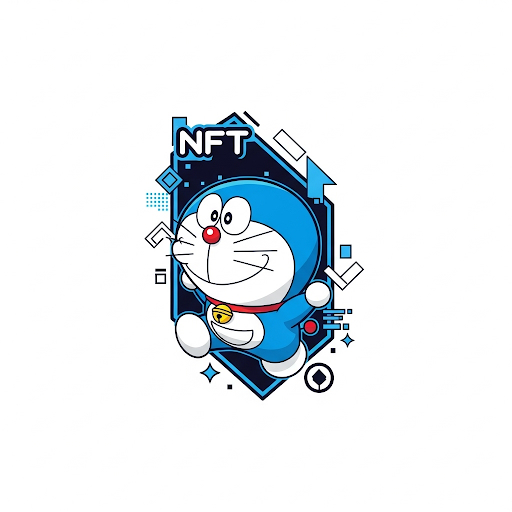

# 💙 Dora Crypto Exchange dApp on Andromeda Protocol

 

---

## 🪙 What is Dora Crypto Exchange dApp?

The **Dora Crypto Exchange dApp** is a fun, secure, and decentralized exchange built on the powerful **Andromeda Protocol** (chain ID: `elgafar-1`).  
It allows users to **swap tokens like CW20 and uandr** using verified smart contracts — all within a clean, user-friendly interface.

This project blends **simplicity, speed, and safety** with a fun visual design inspired by everyone's favorite robotic cat 🐱💼.

---

## ✨ Highlights & Features

- 🔄 **Token Swap Engine**  
  Seamlessly swap `uandr` ↔️ CW20 tokens in real-time.

- 🔐 **Smart Contract Security**  
  Built with verified Andromeda modules for high reliability.

- 🧩 **Modular Architecture**  
  Collections make integration easy and future-ready.

- 🌐 **Runs on Andromeda Protocol**  
  Leveraging Cosmos-based, scalable blockchain power.

- 🧑‍💻 **Beginner-Friendly UI**  
  Clean layout with on-screen wallet integration and clear token flows.

- 🎯 **Embeddable Anywhere**  
  Designed to run in iFrames or standalone in dApps, websites, or dashboards.

---


| Key Info               | Value |
|------------------------|-------|
| **Chain ID**           | `elgafar-1` |
| **Coin Denomination**  | `uandr` |
| **Exchange Address**   | `andr1juelw6h77mhneqxfy457ge6gq3xjqp3kx302qt00tm7r2p8c0hxsjhenfz` |
| **CW20 Token Address** | `andr184pswkfg35s482rgnvun9409zj89f37rq6mal5snx5yq2l8ah9eqzzznzq` |
| **Module Type**        | `EXCHANGE` |
| **dApp ID**            | `andromeda` |
| **Created On**         | `2024-03-31` |

---

## 🧩 Smart Module Collection

```json
{
  "exchange": "andr1juelw6h77mhneqxfy457ge6gq3xjqp3kx302qt00tm7r2p8c0hxsjhenfz",
  "cw20": "andr184pswkfg35s482rgnvun9409zj89f37rq6mal5snx5yq2l8ah9eqzzznzq",
  "name": "Dora Crypto Exchange dApp",
  "type": "EXCHANGE",
  "id": "embeddables-exchange-1"
}
